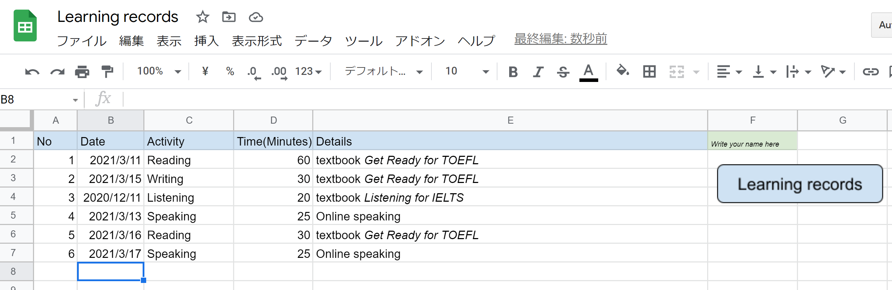
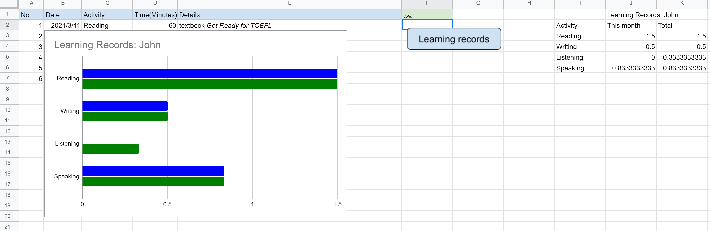

# learning_records 
A google spreadsheet for recording everyday learning for learners and visualize them monthly, i.e. monthly total hours and whole total hours. 
 
This Google spreadsheet can be used for recording learners' everyday learning and visualize thier effort easily. This is mainly for autonomous learning. 
 
Set up: 
&nbsp;&nbsp;0. You can get the same spreadsheet file with the same GAS script from <A href="https://docs.google.com/spreadsheets/d/1JFSneO_poo24kiEoi7RdhQ3rWC2LL535ZNZIFOqQRGk/edit?usp=sharing">here</a>. Open it and 'Create a copy' from 'File' tab, or 
 
1. Download the 'Learning_records_github.xlsx' file and put it on your google Drive.  
&nbsp;&nbsp;&nbsp;&nbsp;   If you are a teacher, share it and have students make a copy of the excel file. 
2. Open the excel file and click the 'Learning Records' button once.  
&nbsp;&nbsp;&nbsp;&nbsp;   a) If a warning dialog comes up, ignore it and continue to open the file and accept the file. 
&nbsp;&nbsp;&nbsp;&nbsp;   b) If nothing happens, click 'Tool' - 'Script Editor' and then copy and paste the content of the 'learning_records.gs' file.  
&nbsp;&nbsp;&nbsp;&nbsp;&nbsp;&nbsp;      Then go back to the spreadsheet, and right click the 'Learning Records' button once, and then click the three-dot button  
&nbsp;&nbsp;&nbsp;&nbsp;&nbsp;&nbsp;      on the top right of the button. Then click 'Assign script' and write 'learning_records'. 
3. Now you can ready for using this learning records file. 
 
How you use: 
You will record your learning activities on the spreadsheet. Write date, activity type, minutes you spent on learning, and description 
as shown above. Do not forgot to write your name on the green F1 cell. 
You can create a bar chart to make sure your learning history monthly. Click 'Learning Records' button. 
Then you can see the chart as follows:  
Blue bar shows the total hours of your learning in each activity. Green bar shows monthly hours you have learned in each activity. 
You can also get a table on the right corner of the spreadsheet. 
 
Example: 
If you use this spreadsheet for autonomous language learning, set your activity types as four: speaking, listening, writing and reading. 
Then record total minutes on the spreadsheet. The spreadsheet will show you how many hours you learned in edach activity monthly and on the whole. 
Set your learning more than 1000 hours in each activity type, and keep learning more than 20 hours per month in each activity type.  
It would be four years study but you can improve your proficiency. Keep learning and try not to hurry in. 

